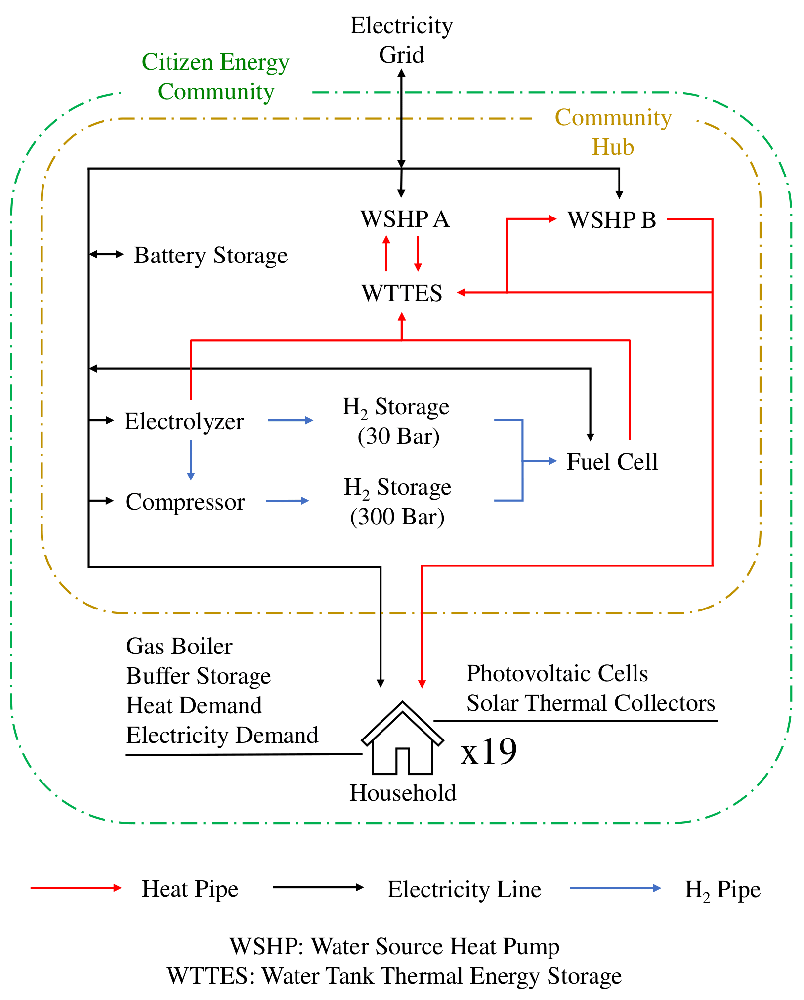

The model is developed for Calliope 0.6.6 to simulate seasonal hydrogen storage in a theoretical energy community. If you are interested in the time series data, please send an email to manuel.katholnigg@student.kit.edu.

